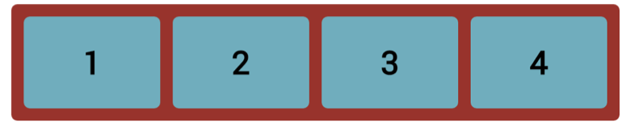
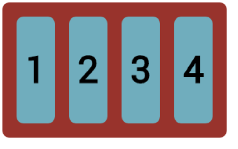
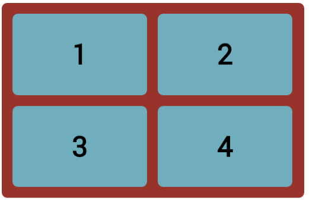
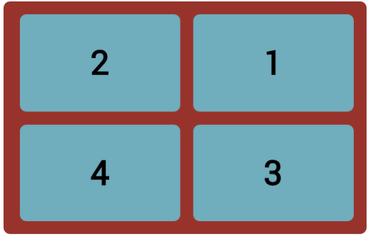
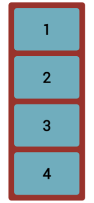

# Challenge: Flexbox

Let's return to your lesson 2, walkthrough (or you  can download the boxes.html file in the lesson folder). 
Numbers have been added for illustration. 

1.  Make the container a flex container.
2.  Make the container's width 80%, so it will resize dynamically.
3.  Make the containers height 600px.
4.  Change the width of the box class to 150px.

Try to achieve the below layouts:
 

  

  

5.  Increase the width of the box class to 250px;
6.  Change the flex-direction to row(the default).
7.  Resize the browser, notice how the boxes react.
  

Try to achieve the below layouts(you will also need to resize the window to get the exact layout):
 

  

  
  

