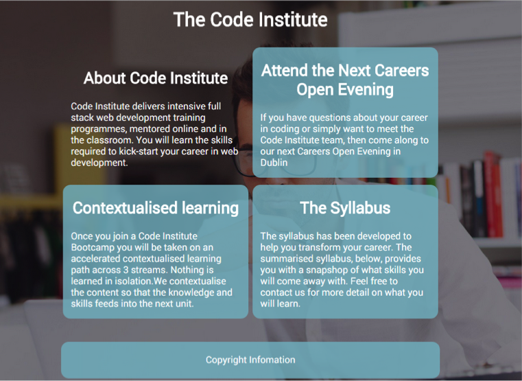

# Challenge: Walkthrough project


Let’s take a look at a previous challenge (download in lesson folder under walkthrough).

We will explore some of the issues with layout, and then see how the flexbox model can help.



**inline-block** is used for the content boxes but there are a few issues.

**1-** If you add more text to one of the boxes the layout becomes distorted.(see below)

**2-** You can remedy this to some degree by vertically aligning the _content_ boxes to the top, but it still looks odd.


try vertical-align: top;

**3-** You can also give all the boxes a minimum height, allowing some more room for text. However, if you add more text again, you break the minimum height, and cause the same problem.


Minimum height of 400px but we can still break that limit

Another issue with this layout happens when the user reduces the size of the window. Eventually there will not be enough width for the content side-by-side and the content will drop below each other. This is one of the major problems using fixed widths (pixel values) rather than relative ones (%), and leads to unresponsive web pages.


By using the flexbox model, these issues should disappear with a few lines of CSS.

1-	Inside the container class, setup the flexbox:

```css
    display: flex;          /* makes container a flexbox*/
    flex-flow: row wrap;    /* layout the boxes in rows and wrap them*/
    justify-content: space-around; /* margins will be divided equally*/
    max-width:1050px;              /* (optional)change from 960px to 1050*/
```


2-	In the content class (which are now flex items), add the following:

```css
    flex:1;  /* give each item an equal flex number(1 for example)*/
    min-width: 280px;   /* give a minimum width for each*/
```

That’s it!


_Note: The flexbox model is by no means the only way to fix these layout issues but it does provide an elegant solution._
