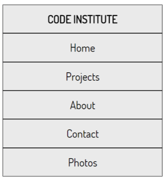
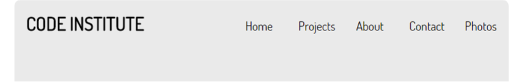

# Challenge: Using Flexbox with Navigation and Media Query

Files for this challenge are found in the lesson folder(navigation_challenge) 
In this challenge you are give a mobile navigation
 

Unlike the previous example this does not use lists elements.

- The challenge is to complete the code in the media query to create the below layout for screens greater than 700px.
- The layout uses flexboxes, and and use of flexboxes should be in the solution. 

 
Download the files for this Challenge in this lessons folder(flexbox-nav-challenge.html)  
Before beginning , take some time to explore the code  

_Hint: the use of baseline in the above lesson may be of use_

